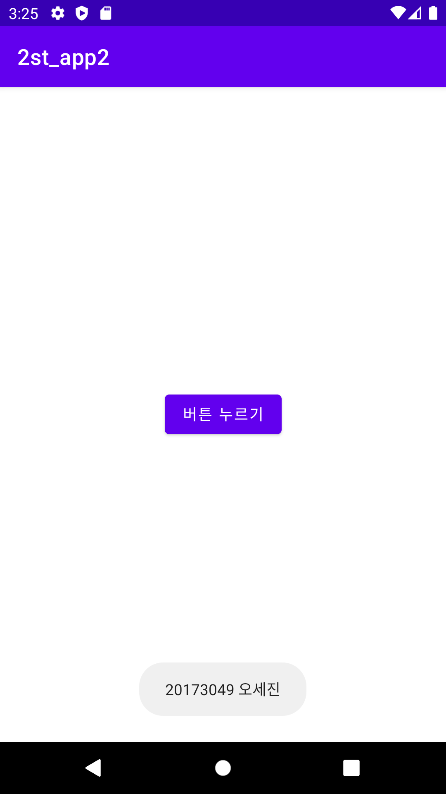
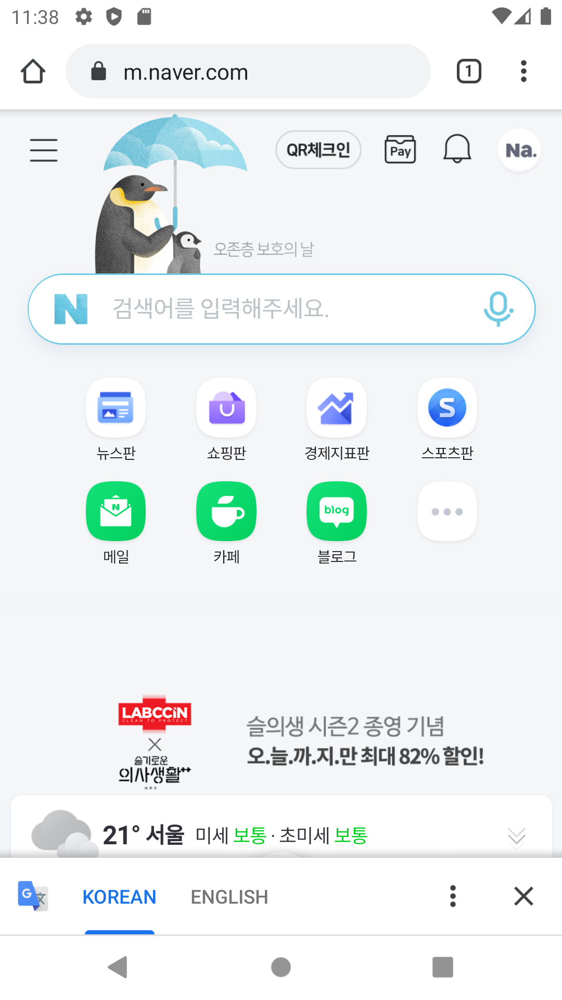
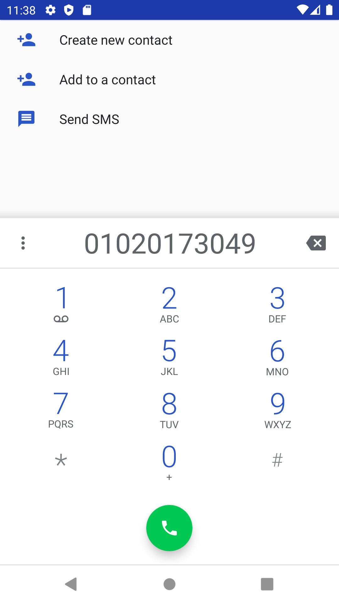
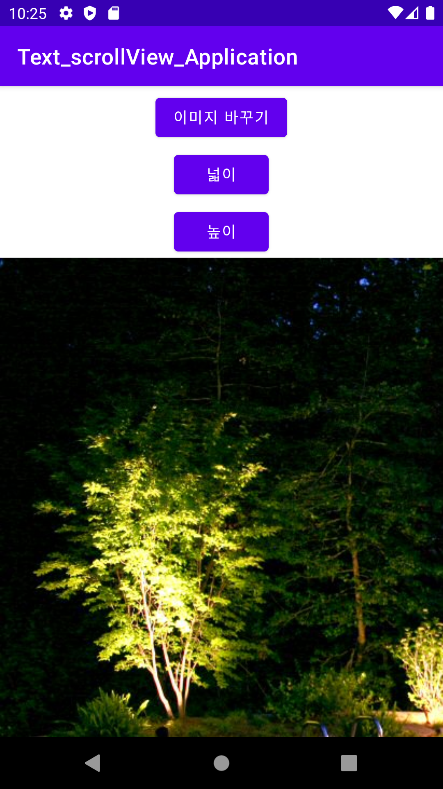
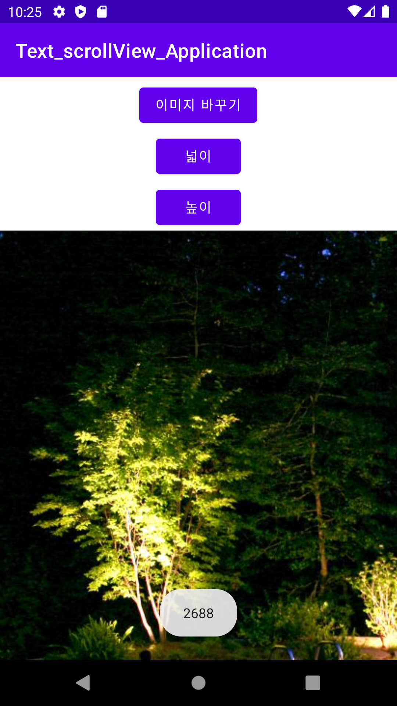
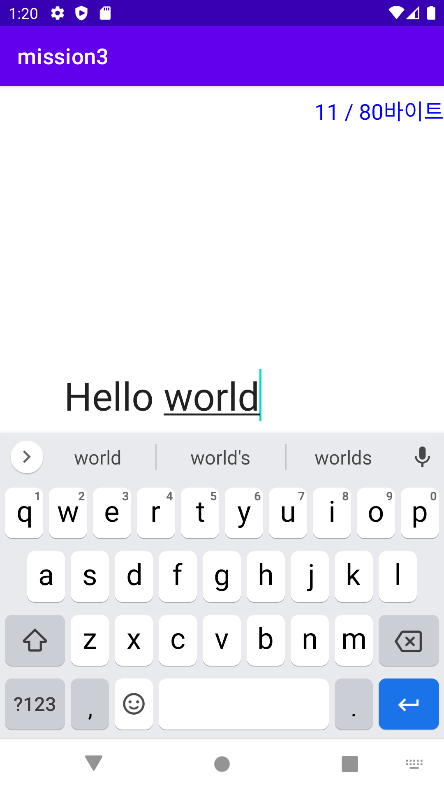
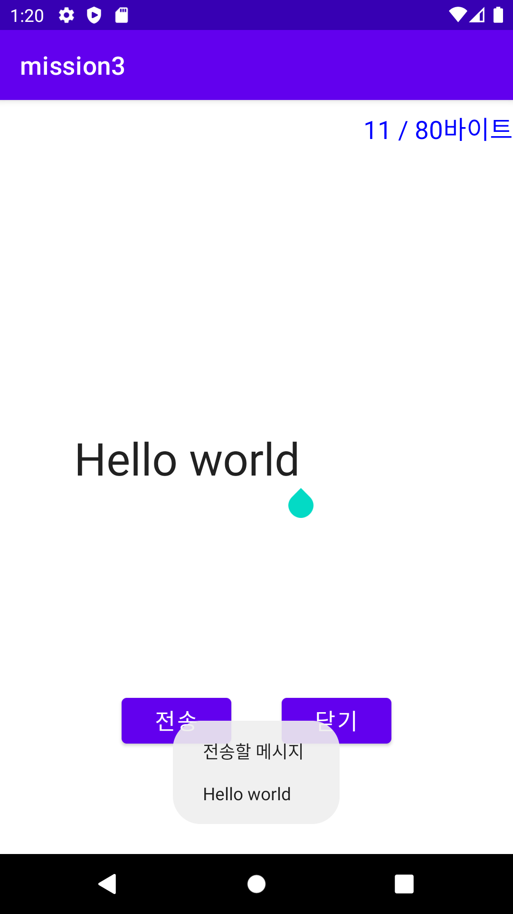

# 20173049 오세진 - 캡스톤디자인 안드로이드 앱 프로그래밍

## 1주차 과제

## 2주차 과제
  - Github 사용법
  - 안드로이드앱 프로그래밍 시작
    - Toast 알림
    - AVD 시작하기

</img>

## 3주차 과제
</img>
</img>

## 4주차 과제
"각 카페 별 칼로리가 낮은 다양한 메뉴를 추천해 주는 앱"

보통 카페에 가면 메뉴를 선택하는 데에 은근히 시간을 많이 할애하게 됩니다. 만약 다이어터의 경우 최소한의 칼로리 섭취와 영양가 있는 메뉴를 선택하기 위해 시간을 더욱 할애하게 될 것입니다. 이 앱은 각 카페 별로 다이어터를 위한 칼로리가 낮은 다양한 메뉴를 추천해 카페에 가서 고민하는 시간을 줄여줍니다. 원하는 제품을 선택하면 가격과 메뉴에 대한 간단한 설명을 볼 수 있고, 칼로리뿐만 아니라 제품의 영양 정보까지 확인이 가능해 균형 잡힌 식단을 선택할 확률이 더욱 높아집니다. 같이 먹으면 칼로리가 적절한 음료 등 인기 있는 조합의 메뉴를 추천해 주기도 하고, 모든 카페의 가격과 칼로리를 한눈에 비교가 가능합니다. 또한 유저들 간의 메뉴에 대한 평가와 댓글을 공유하고, 캘린더에 그날 섭취한 메뉴를 기록하면 총 얼마의 칼로리를 섭취했는지 확인할 수 있습니다.

## 5주차 과제
</img>
</img>

## 6주차 과제
</img>
</img>
</img>
</img>

## 7주차 과제
</img>
</img>
